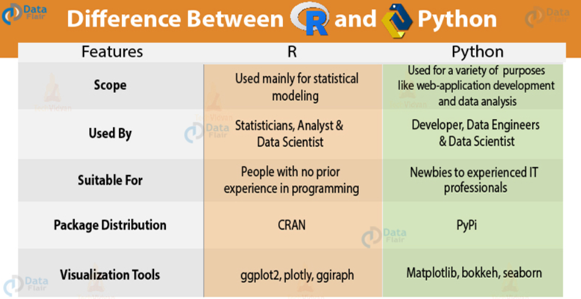

## Wykorzystanie stylów { .format1 }
- Podpunkty
 - help : <http://rmarkdown.rstudio.com>.
 - help : [HELP](http://rmarkdown.rstudio.com)

- Cytowanie
 - Takie jak w R-Presentation
 
 > To jest tekst cytowany. To jest tekst cytowany. To jest tekst cytowany. To jest tekst
cytowany. To jest tekst cytowany. To jest tekst cytowany. To jest tekst cytowany. To jest
tekst cytowany. [^1]

 - według css:

<div class="cited">
To jest tekst cytowany. To jest tekst cytowany. To jest tekst cytowany. To jest tekst
cytowany. To jest tekst cytowany. To jest tekst cytowany. To jest tekst cytowany. To jest
tekst cytowany. [^2]
</div>

<div class="footer"> To jest stopka </div>

- Wyróżnienia:
[^1]: Jakieś źródło 1
[^2]: Jakieś źródło 2

<div class="footer"> To jest stopka </div>

## Elementy wstawiane
- czysty tekst : `plot(cars)` ,
- wstawienie kodu w tekście : `r Sys.Date()`
- wratość przeciętna `r mean(cars$speed)` ,
- Linki do stron internetowych [code chunks](https://bookdown.org/yihui/rmarkdown/rcode.html)
- Rysunki {width=50px}

## Renderowanie obrazu
**To jest obraz !!**
{height=450px}

## Podział na kolumny | obrazy {.flexbox .vcenter}

<div class="columns-2" style="width: 800px;">

### Kol1
{width=250px}
<br/>
<br/>
<br/>

### Kol2
**To jest obraz **
{width=250px}

## Równania
Równanie wpisane w tekście może wyglądać następująco : $\dot{x} = \pi*t^{2}$ . Potem należy wyjaśnić oznaczenia użyte w równaniu jak na przykład $\dot{x}$ oznacza pochodną $x$ po $t$. Równania mogą być także wpisywane w blokach na przykład:
$$
\begin{aligned}
\dot{x} & = \sigma(y-x) \\
\dot{y} & = \rho x - y - xz
\end{aligned}
$$
Wtedy również należy opisać że $\dot{y}$ jest pochodną $y$ względem $x$.

## Kolumny | Podział na dwie równe kolumny
<div class="columns-2" style="width: 800px;">

### Kol1
Ala ma kota
```{r, echo=T}
data(cars)
mean(cars$speed)
```

<br/>
<br/>
<br/>
<br/>

### Kol2
As to Ali pies
</div>

## Slajd z codem | Opcje poleceń
<font color="DarkRed">
- Obliczenie wyniku
```{r}
summary(mtcars$cyl)[3:4]
```
- Wynik i polecenia
```{r, echo=T}
summary(mtcars$mpg)[3:4]
```
- Samo polecenie
```{r,eval=F,echo=T}
summary(mtcars$wt)[3:4]
```
</font>

## Wywołanie skryptu
Wywołanie skryptu: **echo = T/F** , **eval = T/F**
```{r,echo=F, out.width = '800px', out.height = '500px', dpi=200}
p<-getwd()
source(paste0(p,'/szeregi.R'))
 f1("USDPLN")
```

## Wykres
```{r, echo=FALSE}
getData <- function(name) {
 data <-
read.csv(paste0("https://stooq.pl/q/d/l/?s=",name,"&d1=20200101&d2=20201206&i=d")
)
}
d <- getData("USDPLN")
x<-d[,5]
```
```{r}
hist(x,breaks = 11, col=rainbow(15), border = "darkblue", probability = T,
main="Histogram USDPLN")
lines(density(x),col="red",lty="dotted",lwd=3)
rug(x,col="red")
```


## WordCloud {#format1}
```{r, echo=F}
library(wordcloud2)
text<-c("PDF documents are generated through the LaTeX files generated from R
Markdown. A highly surprising fact to LaTeX beginners is that figures float by default even
if you generate a plot in a code chunk on the first page, the whole figure environment
may float to the next page. This is just how LaTeX works by default. It has a tendency to
float figures to the top or bottom of pages. Although it can be annoying and distracting,
we recommend that you refrain from playing the “Whac-A-Mole” game in the beginning
of your writing, desparately trying to position figures “correctly” while they seem to be
always dodging you. You may wish to fine-tune the positions once the content is
complete using the fig.pos chunk option (e.g., fig.pos = 'h'). See
(https://www.overleaf.com/learn/latex/Positioning_images_and_tables) for possible
values of fig.pos and more general tips about this behavior in LaTeX. In short, this can be a
difficult problem for PDF output.
To place multiple figures side-by-side from the same code chunk, you can use the
fig.show='hold' option along with the out.width option. Figure 2.5 shows an example with
two plots, each with a width of 50%.")
text2<-gsub("\n","",text)
text2<-gsub("the","",text2)
text3<-unlist(strsplit(text2,split=" "))
df <- as.data.frame(table(text3))
wordcloud2(df, size=0.6, color='random-dark',shape='star')
```


